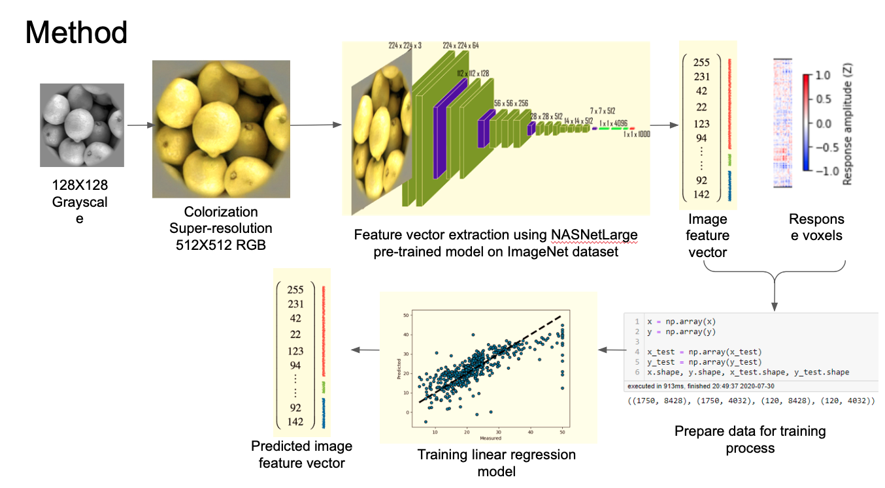
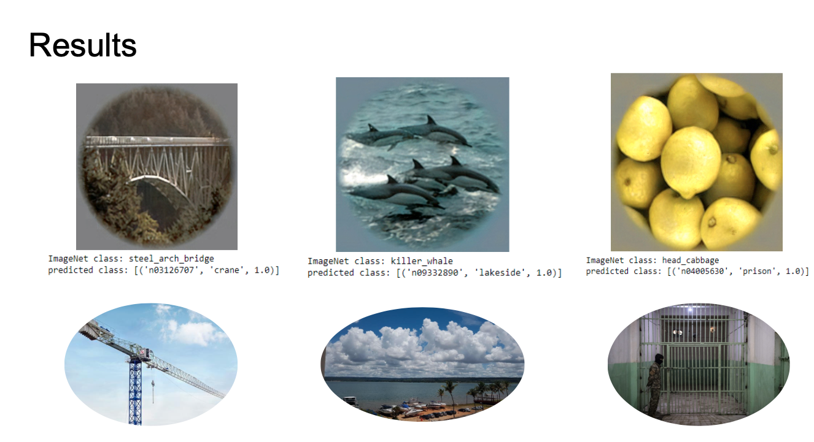

# NeuroTranslator
### Visual cortex voxel responses translation to images feature vectors
Neuromatch Academy 2020 final project.
#### Scientific question
Is it possible to translate visual cortex voxel responses to feature vectors of the image that was seen by the subject?
and what kind of image features are encoded by different visual cortex areas?
#### Brief scientific background
* Image perception is a result of information processing and feature integration on the different levels of the visual cortex. Each brain area has a different function in visual processing, such as feature extraction of color and orientation.
* Kay et al. (2008) showed that it is possible to classify natural scenes images (including novel) based on the neuronal activity from visual cortex.
* Features extraction of an image and image translation are known and solved problems. We can describe Visual cortex responses as a feature vector as well and train a model to translate it back to the original image that was seen by the subject. The responses metadata allows us to see which roi (voxel) is affecting the most on the translation process for every image.
#### Our method

#### Analysis
1. Rescale and colorization of the images used by Kay at al. (2008),
2. Extracting feature vectors from the images using pre-trained model on the ImageNet data,
3. Training the linear regression model on the training fMRI data and training feature vectors,
4. Prediction of the feature vectors from the test fMRI activity,
5. Assessment of the prediction (cosine similarity and correlation coefficient between original and predicted feature vectors), 
6. Running the predicted feature vectors in the pre-trained model on ImageNet and comparison of the classification outputs with the original feature vectors (extracted in step 2).
#### Results

#### Conclusions or experiences
Similarity between predicted feature vectors and feature vectors created by pretrained model on ImageNet was lower than we were expecting. On the other hand, the predicted feature vectors seem to have greater similarity with original feature vectors than vectors containing random numbers. 
 
Interestingly, when we applied regularization in a form of sparse linear regression to predict the feature vectors from the voxel activity the accuracy of the prediction was even worse - the model was more overfitted. We don’t know how is it possible as, in theory, sparse linear regression should decrease overfitting by selecting most important voxels. 
 
Classification on the rescalled and recolorized images from the Kay & Gallant dataset wasn’t perfect. This may be one of the reasons why the accuracy of our prediction was relatively low. To explore this possibility one should use the feature vectors created by model trained on grayscale images or perform similar fMRI study but using high resolution color images. 

#### Authors
Zeev Kalyuzhner, Junya Inoue, Krzysztof Tołpa, Jade Gomes and Gunnar Blohm